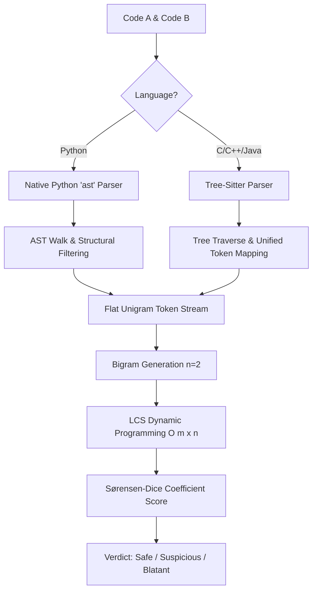

# ASTGuard: Structural & Algorithmic Code Plagiarism Detection Methodology

This document outlines the technical architecture, mathematical models, algorithms, and multi-language parsing pipeline used by **ASTGuard** to detect structural plagiarism in code submissions.

---

## 1. Core Workflow Pipeline

ASTGuard performs structural analysis rather than simple text diffing. Below is the step-by-step pipeline for comparing code submissions:

---

## 2. Methodology & Mathematical Models

### 2.1 AST Parsing & Token Normalization
Traditional text comparison (e.g. cosine similarity, Levenshtein distance) is easily fooled by:
- Renaming variables, function names, and classes.
- Inserting comments or changing docstrings.
- Modifying literals (e.g., changing strings, floats, integers).
- Adding redundant spaces, tabs, or newlines.

**ASTGuard** eliminates these evasion techniques by parsing source code into an **Abstract Syntax Tree (AST)**. During parsing:
1. **Node Extraction:** Only node *types* carrying structural and control-flow information (e.g., `FunctionDef`, `If`, `For`, `While`, `Return`) are captured.
2. **Detail Discarding:** All identifier names, variable assignments, constant literals, and comments are fully stripped.
3. **Pre-order Traversal:** The tree is traversed in a pre-order Depth-First Search (DFS) to build a flat list of structural unigrams.

### 2.2 Unified AST Mapping (Multi-Language)
To compare codes in multiple languages (Python, C++, Java, C) under a single system:
- **Python:** Handled by standard library `ast.parse` and traversed using `ast.NodeVisitor`.
- **C/C++/Java:** Handled by `tree-sitter` and `tree-sitter-languages`.
- **Vocabulary Standardization:** Tree-Sitter's fine-grained grammar represents identical constructs differently across languages. ASTGuard maps these nodes into a unified structural vocabulary (modeled after Python AST representation):
  - `function_definition` / `method_declaration` $\rightarrow$ `FunctionDef`
  - `if_statement` $\rightarrow$ `If`
  - `while_statement` / `do_statement` $\rightarrow$ `While`
  - `binary_expression` $\rightarrow$ `Compare` (if operator is `<, <=, >, >=, ==, !=`) or `BinOp` (others).

This mapping allows the frontend layout engine to display and diff C, C++, and Java trees using the exact same visualization styles and components.

### 2.3 N-gram Generation (Bigrams)
Using single tokens (unigrams) yields high false-positive rates because typical programs naturally share tokens just by virtue of using functions and loops.
To capture **local sequence order**, ASTGuard groups structural unigrams into **bigrams** (n-grams of size $2$).

- **Unigrams:** `["FunctionDef", "For", "If", "Return"]`
- **Bigrams:** `["FunctionDef→For", "For→If", "If→Return"]`

This expands the structural vocabulary size from $\approx 40$ unigrams to $40^2 = 1,600$ possible bigrams, ensuring that matches require local structural operations to be ordered similarly.

---

## 3. Dynamic Programming Algorithm: Longest Common Subsequence (LCS)

To find the largest shared sequence of bigrams between Code A (bigram stream $A$ of length $m$) and Code B (bigram stream $B$ of length $n$), we solve the LCS problem using bottom-up dynamic programming.

### 3.1 Recurrence Relation
Let $dp[i][j]$ represent the length of the LCS of prefixes $A[1 \dots i]$ and $B[1 \dots j]$.

$$
dp[i][j] = 
\begin{cases} 
0 & \text{if } i = 0 \text{ or } j = 0 \\
dp[i-1][j-1] + 1 & \text{if } A[i-1] = B[j-1] \\
\max(dp[i-1][j], dp[i][j-1]) & \text{if } A[i-1] \neq B[j-1]
\end{cases}
$$

### 3.2 Matrix Backtracking
To show exactly which nodes were copied in the frontend, the algorithm backtracks from $dp[m][n]$ back to $dp[0][0]$:
- If $A[i-1] == B[j-1]$, the bigram matches; it is prepended to the LCS path, and we move to $dp[i-1][j-1]$.
- Otherwise, we step into the neighboring cell with the maximum value: $\max(dp[i-1][j], dp[i][j-1])$.

### 3.3 Complexity Analysis
- **Time Complexity:** $\Theta(m \cdot n)$ since we fill out an $(m+1) \times (n+1)$ matrix, where each cell is computed in $O(1)$ time.
- **Space Complexity:** $\Theta(m \cdot n)$ to store the full DP matrix for backtracking.

---

## 4. Similarity Scoring & Verdicts

To normalize the similarity score into a symmetric percentage value, ASTGuard uses the **Sørensen-Dice Coefficient**:

$$\text{Similarity Score} = \frac{2 \times \text{LCS Length}}{\text{Length}(A) + \text{Length}(B)} \times 100$$

### Verdict Thresholds
Due to the stricter alignment required by bigrams compared to unigrams, the verdict ranges are calibrated as follows:

| Score Range | Risk Verdict | Description |
| :--- | :--- | :--- |
| **$< 30\%$** | **Safe** | Genuinely distinct structures and algorithms. |
| **$30\% - 77\%$** | **Suspicious** | Notable structural overlap. Requires manual review. |
| **$\ge 78\%$** | **Blatant** | Near-identical logic flow, strong evidence of plagiarism. |

---

## 5. UI Layout and Visualization Architecture

1. **Monaco Editors:** Serves as the IDE layer, adjusting syntax highlights dynamically based on selected language and applying line decorations (`exact`, `renamed`, `structural`) using delta decorations.
2. **React Flow Tree Renderer:** Consumes the flat unigram list. A stack-based nesting heuristic groups block starts (`If`, `For`, `While`, `Try`) and ends (`Return`, `Break`, `Continue`) to reconstruct parent-child relationships and recursively layout tree positions.
3. **Collision Map:** Implements winnowing algorithms over structural hashes to display matched blocks side-by-side.
